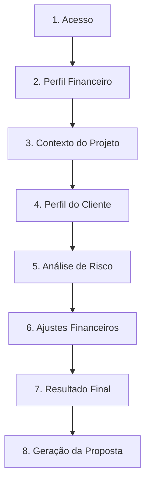

# ValorDev - Sistema de Precificação para Devs Freelancers

Um sistema de calculadora de precificação projetado para ajudar desenvolvedores freelancers a definirem valores de projetos de forma justa, transparente e justificável, considerando o contexto do projeto, metas financeiras, análise de riscos e valor percebido.

## 🚀 Estrutura do Projeto

Este repositório foi construído utilizando uma arquitetura monorepo:
*   `calculator-api/` - API REST em Spring Boot (Backend)
*   `frontend/` - Aplicativo móvel em React Native (Frontend)

---

## 🗺️ Fluxo do Usuário (User Flow)

O sistema foi desenhado em **8 etapas sequenciais** para garantir que o desenvolvedor freelancer consiga calcular o preço justo de um projeto de forma rápida, transparente e baseada em dados reais de mercado.

