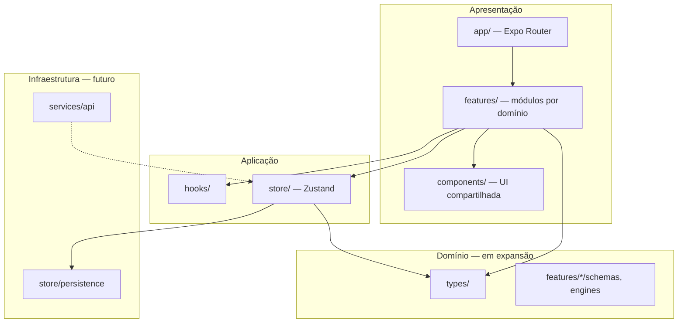
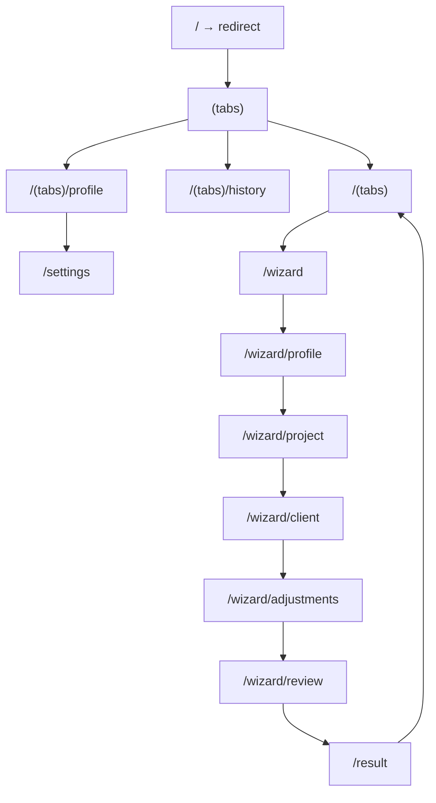
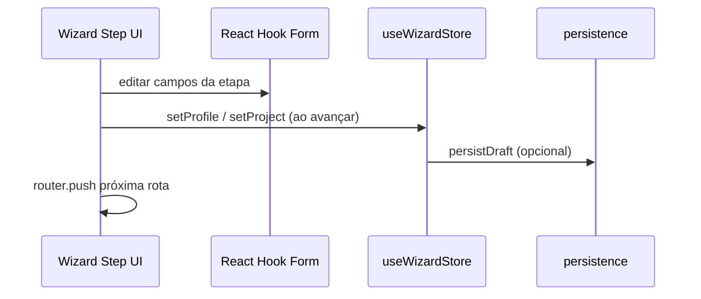
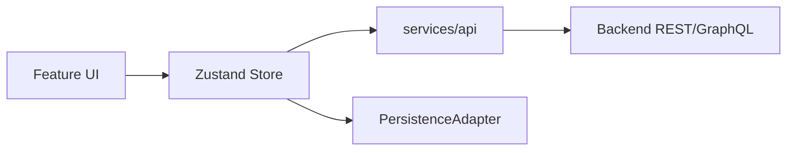
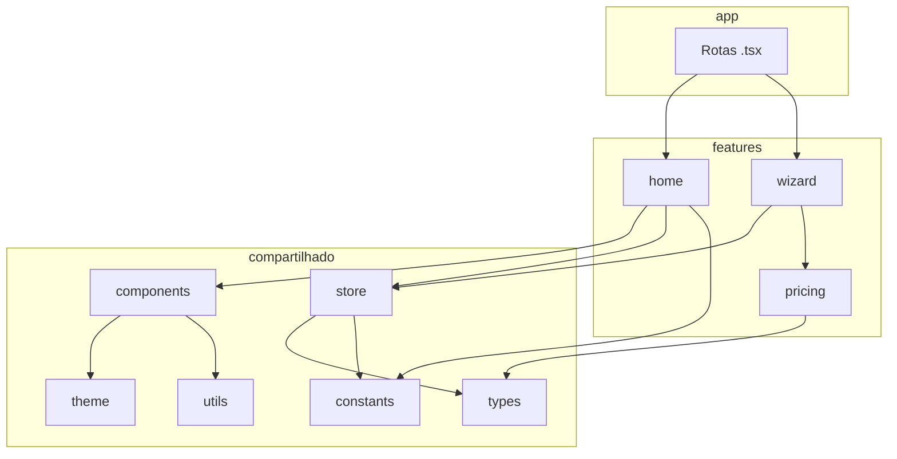

# Mobile Architecture — Pricing Pro

> **Documentação oficial** da arquitetura do app React Native (Expo).  
> Complementa `AI_RULES.md` com decisões estruturais, fluxos e estratégias de longo prazo.

**Localização:** `mobile/`  
**Projeto web (raiz):** referência de design/UX apenas — não faz parte desta arquitetura de runtime.

---

## 1. Visão geral

### 1.1 Propósito

Aplicativo para **calcular e gerenciar propostas de precificação** de projetos, com fluxo guiado (wizard), histórico e resultado detalhado.

### 1.2 Princípios arquiteturais



| Princípio | Implementação |
|-----------|----------------|
| **Modular por domínio** | `features/home`, `features/wizard`, `features/pricing` |
| **Rotas desacopladas** | `app/` só compõe telas |
| **Estado previsível** | Zustand por contexto de negócio |
| **UI consistente** | Design system em `components/ui` + `theme/` |
| **Backend-ready** | Tipos, stores e `PersistenceAdapter` preparados |
| **Mobile-first** | RN primitives, safe areas, performance de lista |

### 1.3 Stack (referência)

Expo SDK 54 · React 19 · React Native 0.81 · Expo Router 6 · NativeWind 4 · Zustand 5 · Reanimated 4 · React Hook Form 7 · Zod · lucide-react-native.

---

## 2. Estrutura oficial de pastas

```
mobile/
├── app/                    # Rotas (Expo Router) — file-based
│   ├── _layout.tsx         # Root Stack
│   ├── index.tsx           # Redirect inicial
│   ├── (tabs)/             # Bottom tabs
│   ├── wizard/             # Stack do wizard
│   ├── result.tsx          # Tela de resultado
│   └── settings.tsx
├── components/             # UI reutilizável entre features
│   ├── ui/                 # Primitivos (Button, Input, Card…)
│   └── layout/             # ScreenContainer, AnimatedSection
├── features/               # Módulos por domínio de negócio
│   ├── home/
│   ├── wizard/
│   └── pricing/
├── store/                  # Estado global Zustand + persistência
├── hooks/                  # Hooks transversais (não ligados a uma feature)
├── types/                  # Tipos e contratos TypeScript
├── constants/              # Rotas, copy, chaves de storage
├── theme/                  # Tokens de design (cores, spacing, tipografia)
├── utils/                  # Funções puras (cn, formatCurrency…)
├── global.css              # Entrada Tailwind / NativeWind
├── tailwind.config.js
├── metro.config.js
├── babel.config.js
├── AI_RULES.md             # Regras para IA
└── MOBILE_ARCHITECTURE.md  # Este documento
```

---

## 3. Detalhamento por pasta

### 3.1 `app/` — Camada de navegação

**Responsabilidade:** definir a árvore de rotas e layouts do Expo Router. Arquivos aqui devem ser **finos** (composição, sem regra de negócio pesada).

| Arquivo / grupo | Função |
|-----------------|--------|
| `_layout.tsx` | Stack raiz: tabs, wizard, result, settings; hydrate de stores; GestureHandler + splash |
| `(tabs)/_layout.tsx` | Tab bar (Home, Histórico, Perfil) |
| `wizard/_layout.tsx` | Stack linear do wizard (5 etapas + intro) |
| `index.tsx` | Redirect para home |
| `+not-found.tsx` | 404 |

**Regra:** navegação programática via `useRouter()` + `ROUTES` (`constants/routes.ts`).

### 3.2 `components/` — Design system compartilhado

| Subpasta | Conteúdo | Critério de inclusão |
|----------|----------|----------------------|
| `ui/` | Primitivos visuais | Usado por **2+ features** ou previsto como padrão global |
| `layout/` | Estruturas de tela | Safe area, scroll, animação de entrada |

**Não colocar aqui:** componentes usados por uma única feature (vão em `features/<x>/components/`).

**Componentes base atuais:** `Button`, `Input`, `Card`, `Badge`, `Progress`.

### 3.3 `features/` — Domínios do produto

Cada feature é um **módulo vertical** com UI e lógica de apresentação daquele contexto.

```
features/<nome>/
├── components/     # UI específica do domínio
├── hooks/          # useHomeScreen, useWizardStep, etc.
├── schemas.ts      # (futuro) Zod
├── services.ts     # (futuro) chamadas API do domínio
└── index.ts        # API pública da feature (exports)
```

| Feature | Status | Responsabilidade |
|---------|--------|------------------|
| `home` | Implementada | Dashboard, CTA wizard, recentes, dica |
| `wizard` | Placeholder / em migração | Formulário multi-step |
| `pricing` | Planejada | `calculatePricing`, breakdown, confiança |

**Regra de ouro:** `app/(tabs)/index.tsx` importa de `@/features/home`, não contém markup extenso.

### 3.4 `store/` — Estado global

| Arquivo | Store | Dados |
|---------|-------|-------|
| `wizard.store.ts` | `useWizardStore` | profile, project, client, adjustments, result |
| `history.store.ts` | `useHistoryStore` | lista de propostas (`items`), `fetchHistory` — derivar recentes com `useMemo` no hook |
| `persistence.ts` | — | `PersistenceAdapter`, `persistJson`, `loadJson` |

**Persistência:** implementação atual em memória; troca futura por AsyncStorage/MMKV via `setPersistenceAdapter()` sem alterar assinaturas das stores.

**Chaves:** `constants/wizard.ts` → `STORAGE_KEYS`.

### 3.5 `hooks/` — Hooks transversais

Hooks que **não pertencem a uma única feature** (ex.: `useWizardNavigation`).

Hooks de tela específica ficam em `features/<nome>/hooks/`.

### 3.6 `types/` — Contratos TypeScript

| Arquivo | Conteúdo |
|---------|----------|
| `pricing.types.ts` | `ProfileData`, `ProjectData`, `PricingResult`, `HistoryItem`, enums |
| `navigation.types.ts` | Aliases de rotas tipadas |

Tipos de domínio são a **fonte da verdade** para formulários, stores e API futura.

### 3.7 `constants/` — Configuração estática

| Arquivo | Uso |
|---------|-----|
| `routes.ts` | `ROUTES` — paths do Expo Router |
| `wizard.ts` | passos do wizard, `STORAGE_KEYS` |
| `home.ts` | copy da Home (`HOME_COPY`) |

### 3.8 `theme/` — Design tokens (JS)

`colors.ts`, `spacing.ts`, `typography.ts`, `index.ts` — usados em ícones, gradientes e configs que não aceitam só `className`.

Espelhados em `tailwind.config.js` → `theme.extend` para NativeWind.

### 3.9 `utils/` — Funções puras

Sem efeitos colaterais, sem React. Ex.: `cn()`, `formatCurrency()`, `formatRelativeDate()`.

---

## 4. Estratégia de navegação

### 4.1 Expo Router (file-based)

- **Sem** `createNativeStackNavigator` manual.
- Rotas tipadas (`experiments.typedRoutes`).
- Deep linking via `scheme` em `app.json` (`pricingpro`).

### 4.2 Mapa de navegação



### 4.3 Tabs inferiores

Grupo `(tabs)` com `Tabs` do Expo Router. Telas principais do app pós-onboarding (futuro).

`ScreenContainer` com `withTabBar` adiciona padding inferior para não sobrepor a tab bar.

### 4.4 Wizard (stack multi-step)

- Grupo `app/wizard/` com `Stack` próprio.
- Fluxo: intro → profile → project → client → adjustments → review → **result** (fora do wizard, no root stack).
- `useWizardNavigation` centraliza `router.push(ROUTES.wizard.*)`.
- Ao iniciar novo cálculo: `resetWizard()` + `router.push(ROUTES.wizard.intro)`.

### 4.5 Boas práticas

- `router.replace` ao concluir fluxo (evitar voltar para review).
- `gestureEnabled: false` na review se necessário impedir swipe acidental.
- Headers configurados no `_layout.tsx` do grupo, não duplicados em cada tela.

---

## 5. Estratégia de estado

### 5.1 Zustand

| Store | Quando usar |
|-------|-------------|
| `useWizardStore` | Dados entre etapas do wizard + resultado |
| `useHistoryStore` | Lista de propostas compartilhada (Home + Histórico) |

### 5.2 Fluxo do wizard



### 5.3 Persistência

```typescript
// store/persistence.ts
interface PersistenceAdapter {
  getItem(key: string): Promise<string | null>;
  setItem(key: string, value: string): Promise<void>;
  removeItem(key: string): Promise<void>;
}
```

| Chave (`STORAGE_KEYS`) | Conteúdo |
|------------------------|----------|
| `wizardDraft` | Rascunho do wizard |
| `history` | Propostas salvas |
| `onboardingSeen` | (futuro) flag onboarding |
| `settings` | (futuro) preferências |

**Boot:** `app/_layout.tsx` chama `hydrateFromStorage()` / `hydrate()` antes de esconder splash.

---

## 6. Estratégia de UI

### 6.1 NativeWind

- `className` em componentes RN suportados.
- `global.css` com diretivas Tailwind; Metro processa via `withNativeWind`.
- `babel.config.js`: `jsxImportSource: "nativewind"` + preset `nativewind/babel`.

### 6.2 Tema e design system

| Camada | Fonte |
|--------|--------|
| Utilitários Tailwind | `tailwind.config.js` |
| Tokens JS | `theme/*.ts` |
| Merge de classes | `utils/cn.ts` |

### 6.3 Componentes base vs feature

- **Base:** interação padrão (botão, campo, card).
- **Feature:** composição semântica (ex.: `NewCalculationCard`).

### 6.4 Animações

- `components/layout/AnimatedSection.tsx` — `FadeInDown` (Reanimated).
- Padrão: delays escalonados em listas/seções da Home.
- Evitar animar tudo; priorizar hero, entradas de tela e feedback de conclusão.

### 6.5 Ícones

`lucide-react-native` — tamanhos 20–24 em ações, 40 em hero; cores de `theme/colors.ts`.

---

## 7. Estratégia de formulários

### 7.1 Stack

- **React Hook Form** — performance, menos re-renders.
- **Zod** — schemas em `features/wizard/schemas.ts` (futuro).
- **@hookform/resolvers/zod** — validação integrada.

### 7.2 Padrão por etapa do wizard

1. Schema Zod da etapa.
2. `useForm({ resolver: zodResolver(schema), defaultValues })` — defaults do `useWizardStore`.
3. Submit → validar → `setProfile` (etc.) → `persistDraft()` → navegar.

### 7.3 Separação

| Camada | Conteúdo |
|--------|----------|
| UI | `features/wizard/components/*StepForm.tsx` |
| Validação | `features/wizard/schemas.ts` |
| Estado compartilhado | `useWizardStore` |
| Cálculo final | `features/pricing/calculatePricing.ts` |

**Não** validar regras de precificação complexas no schema de campo simples — delegar ao motor de pricing.

---

## 8. Estratégia de features (domínio)

### 8.1 Como criar uma nova feature

1. Criar `features/<nome>/` com `components/`, `hooks/`, `index.ts`.
2. Adicionar rota em `app/` (grupo ou arquivo).
3. Registrar path em `constants/routes.ts` → `ROUTES`.
4. Se estado global necessário → `store/<nome>.store.ts` + export em `store/index.ts`.
5. Tipos em `types/` se cruzar features.
6. Documentar copy em `constants/` se houver strings de UI.

### 8.2 Isolamento

- Features **não importam** componentes internos de outras features.
- Comunicação via **stores compartilhadas**, **tipos** ou **callbacks de navegação**.
- API pública de cada feature: exports do `index.ts`.

### 8.3 Feature `pricing` (planejada)

```typescript
// features/pricing/calculatePricing.ts
function calculatePricing(input: WizardFormData): PricingResult
```

Consumida em `wizard/review` e `result`. Testável sem UI.

---

## 9. Estratégia de backend futuro

### 9.1 Camada de serviços (a criar)

```
services/
├── api/
│   ├── client.ts       # fetch + baseURL + interceptors
│   └── proposals.ts    # CRUD propostas
└── index.ts
```

**Regra:** componentes e rotas **não** chamam `fetch` diretamente.

### 9.2 Integração com stores



- `fetchHistory()` → substitui mock em `history.store.ts`.
- `saveProposal()` → POST + `persistHistory` local.
- Erros tratados na store (loading, error) ou hook `useAsync`.

### 9.3 Autenticação (futuro)

- `store/auth.store.ts`.
- Rotas protegidas: grupo `(auth)` ou redirect em `_layout.tsx`.
- Token no adapter de persistência segura (SecureStore).

### 9.4 Offline

- Leitura: cache local primeiro, refresh em background.
- Escrita: fila de mutações + retry (padrão outbox simplificado).
- Mesmas chaves `STORAGE_KEYS` para cache.

---

## 10. Estratégia de performance

| Área | Diretriz |
|------|----------|
| Listas | `FlatList` com `windowSize`, `maxToRenderPerBatch` ajustados |
| Estado | Seletores Zustand específicos |
| Imagens | `expo-image` com cache |
| Bundle | imports diretos de ícones (tree-shaking lucide) |
| Animações | Reanimated worklets; evitar `LayoutAnimation` em listas grandes |
| Lazy loading | `React.lazy` / rotas dinâmicas só quando bundle crescer |

### Renders

- Evitar criar funções/objetos inline em `FlatList` `renderItem`.
- `React.memo` em itens de lista caros (ex.: card de histórico).

---

## 11. Crescimento e manutenção do app

### 11.1 Adicionar nova tela

1. Definir se é **tab**, **stack** ou **modal**.
2. Criar arquivo em `app/...`.
3. Adicionar `ROUTES.*`.
4. Implementar UI em `features/<domínio>/`.
5. Atualizar layouts `_layout.tsx` se precisar de header/options.

### 11.2 Adicionar nova store

1. Criar `store/<nome>.store.ts`.
2. Exportar em `store/index.ts`.
3. Hydrate no `_layout.tsx` se precisar no boot.
4. Documentar chaves em `STORAGE_KEYS` se persistir.

### 11.3 Adicionar componente ao design system

1. Confirmar uso em 2+ contextos.
2. Criar em `components/ui/`.
3. Exportar em `components/ui/index.ts`.
4. Estender `tailwind.config.js` se novos tokens.

### 11.4 Checklist de consistência

- [ ] `npm run typecheck` passa
- [ ] Rotas em `ROUTES`
- [ ] Sem dependência web
- [ ] Copy em `constants/` quando reutilizado
- [ ] Tipos em `types/` para dados de negócio

### 11.5 Referência web (Figma / `src/` na raiz)

| Pode usar | Não pode usar |
|-----------|----------------|
| Layout, hierarquia, textos | JSX, CSS, Radix, hooks web |
| Fluxo de telas | `react-router` web |
| Valores de negócio (enums) | Componentes shadcn |

---

## 12. Diagrama de dependências (alto nível)



---

## 13. Comandos úteis

```bash
cd mobile
npm install
npm start
npm run android
npm run ios
npm run typecheck
```

---

## 14. Documentos do projeto

| Arquivo | Público | Conteúdo |
|---------|---------|----------|
| `AI_RULES.md` | IA + devs | Regras obrigatórias e proibições |
| `MOBILE_ARCHITECTURE.md` | IA + devs | Estrutura, fluxos, estratégias |
| `README.md` | Devs | Setup rápido |

---

*Documento vivo. Atualizar ao introduzir: camada `services/`, auth, nova feature major ou mudança de navegação.*
