# Casos de Uso - ValorDev 🚀

Este documento descreve os Casos de Uso (Use Cases) do sistema **ValorDev**, mapeando as interações dos usuários (freelancers) com a plataforma, detalhando o funcionamento de cada etapa e propondo novas funcionalidades para expandir a solução.

---

## 🗺️ Diagrama Geral de Casos de Uso (Atual)

O diagrama abaixo ilustra os atores e a visão geral de todos os casos de uso atualmente implementados ou planejados para a base do sistema:

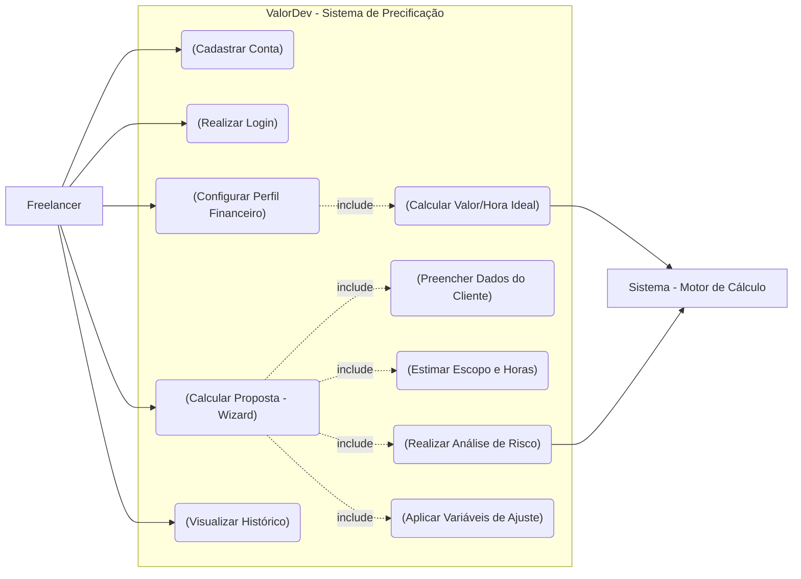

---

## 📝 Detalhamento e Fluxos dos Casos de Uso Atuais

Abaixo, detalhamos o funcionamento de cada caso de uso atual acompanhado de seu respectivo diagrama de sequência para ilustrar o fluxo de informações:

### 1. Cadastrar Conta (Cadastro)
* **Ator Principal**: Freelancer.
* **Descrição**: Permite que um novo desenvolvedor/designer crie uma conta no aplicativo utilizando e-mail e senha.
* **Fluxo de Sistema**:

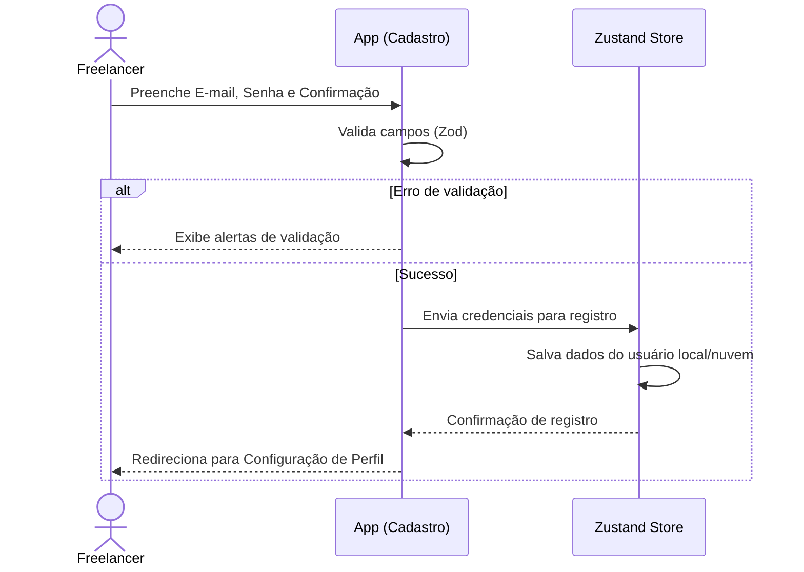

---

### 2. Realizar Login
* **Ator Principal**: Freelancer.
* **Descrição**: Autenticação de usuários já cadastrados para acessar suas informações e propostas.
* **Fluxo de Sistema**:

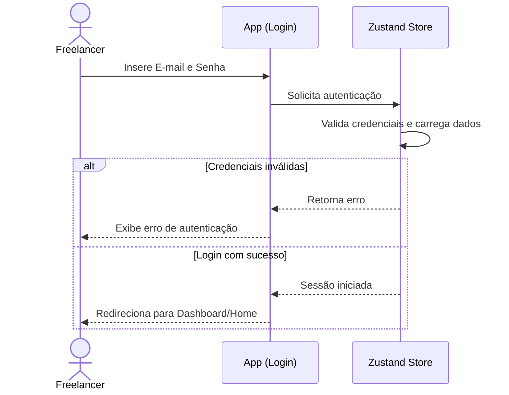

---

### 3. Configurar Perfil Financeiro
* **Ator Principal**: Freelancer.
* **Atores Coadjuvantes**: Sistema.
* **Descrição**: Definição de despesas, metas de rendimento e horas produtivas para obter a taxa horária ideal.
* **Fluxo de Sistema**:

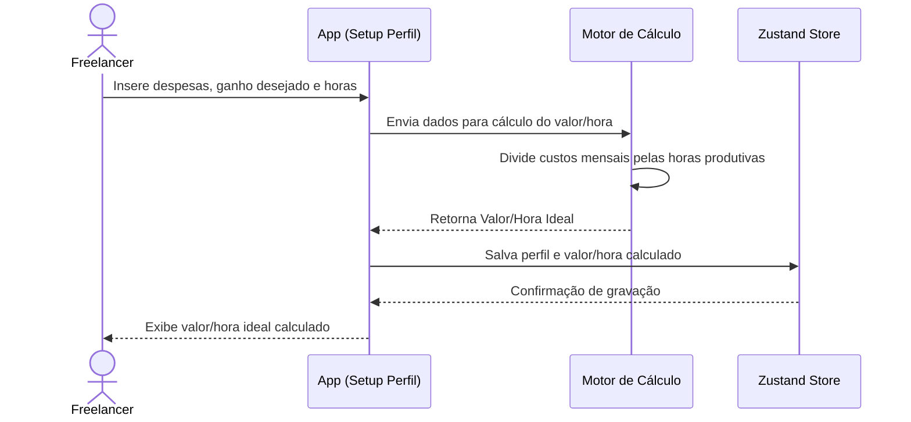

---

### 4. Calcular Proposta (Wizard)
* **Ator Principal**: Freelancer.
* **Atores Coadjuvantes**: Sistema.
* **Descrição**: Guia passo a passo para calcular o preço ideal de um projeto de software/design.
* **Fluxo de Sistema**:

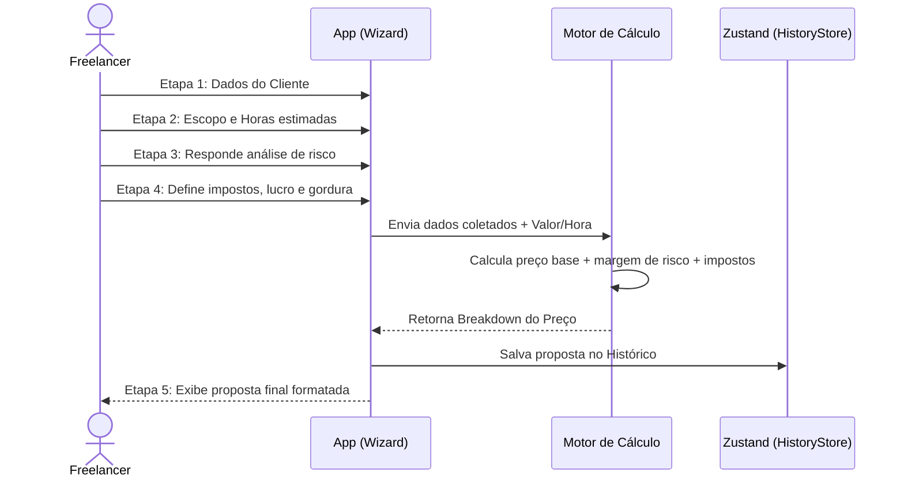

---

### 5. Histórico de Estimativas
* **Ator Principal**: Freelancer.
* **Descrição**: Listagem de todas as propostas salvas no dispositivo para posterior consulta.
* **Fluxo de Sistema**:

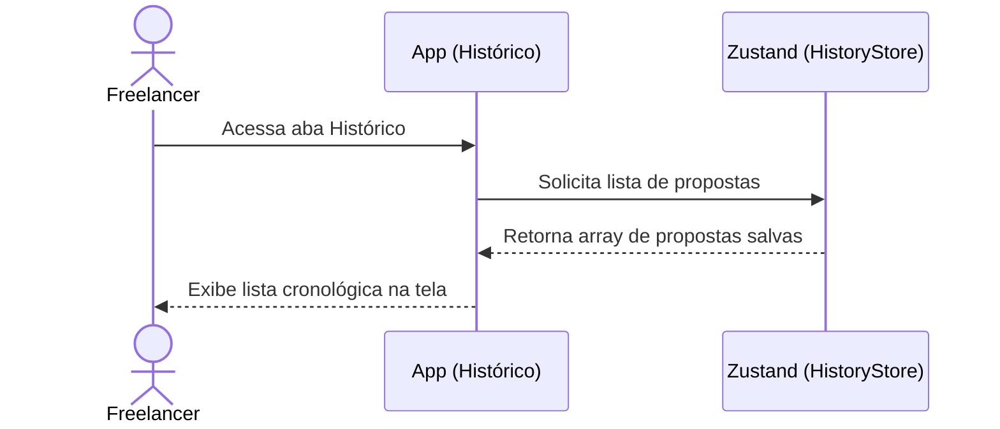

---

## 💡 Sugestões de Novos Casos de Uso (Em Parte Separada)

Abaixo estão descritos e mapeados individualmente os novos casos de uso sugeridos para o ecossistema do **ValorDev**:

### 🗺️ Diagrama Geral de Casos de Uso Expandido

Este diagrama ilustra a integração dos novos casos de uso recomendados:

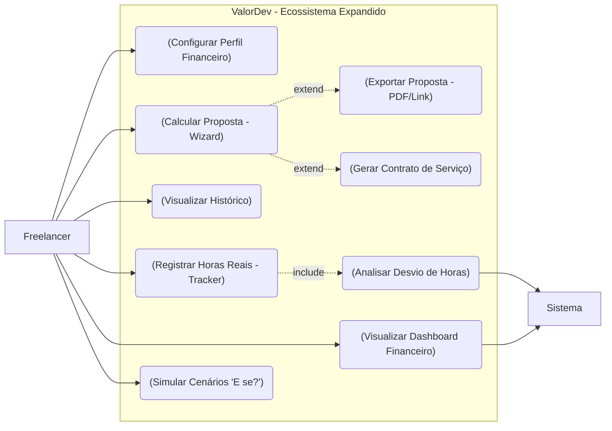

---

### Detalhamento dos Novos Fluxos

### 6. Exportar Proposta Comercial (PDF ou Link)
* **Descrição**: Permite exportar a proposta comercial detalhada em PDF ou gerar um link público seguro para compartilhamento direto com o cliente final.
* **Fluxo de Sistema**:

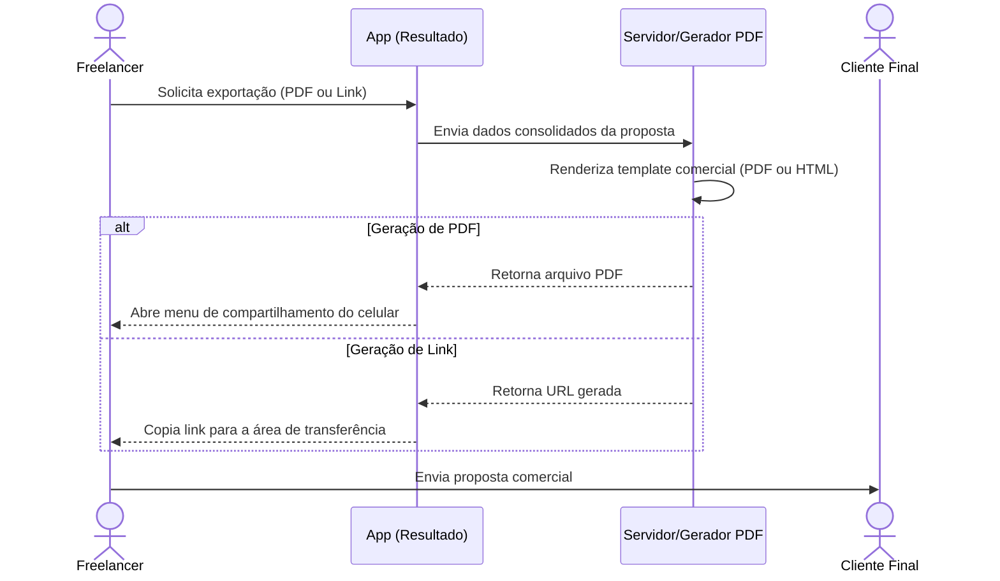

---

### 7. Registro de Horas Reais vs. Estimadas (Time Tracker)
* **Descrição**: Timer integrado que permite ao freelancer medir as horas efetivamente gastas em tarefas e compará-las com a estimativa do Wizard (análise de desvio).
* **Fluxo de Sistema**:

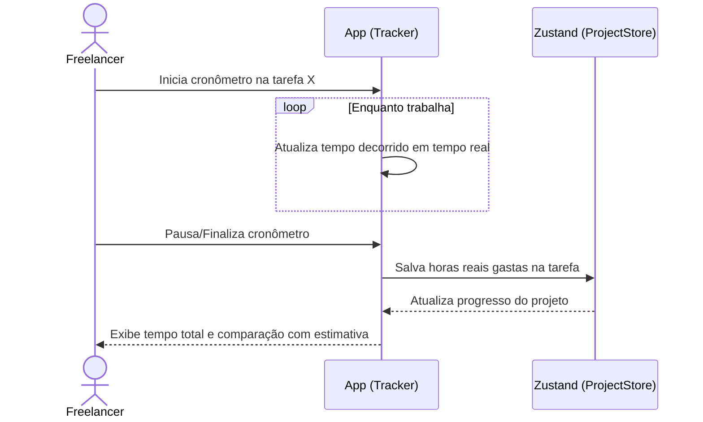

---

### 8. Dashboard de Saúde Financeira
* **Descrição**: Gráficos consolidados do faturamento de projetos ativos, faturamento planejado e taxa de conversão de propostas.
* **Fluxo de Sistema**:

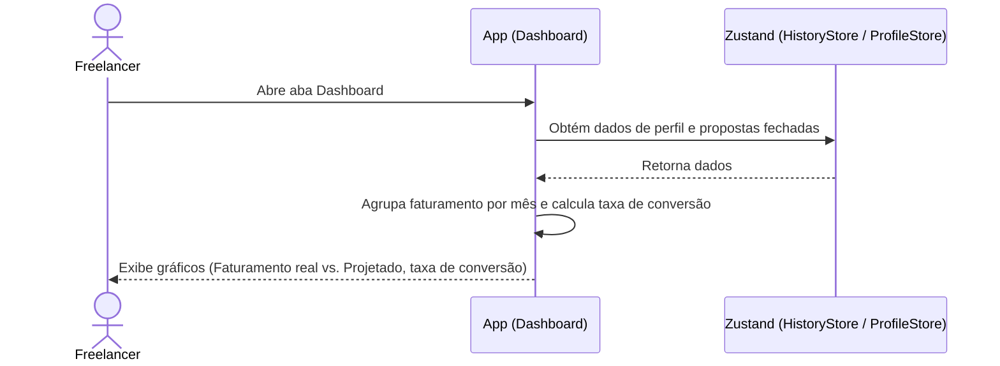

---

### 9. Gerador Automatizado de Contratos
* **Descrição**: Preenche automaticamente um contrato jurídico básico de prestação de serviços com os valores, datas de entrega e escopo gerados no Wizard.
* **Fluxo de Sistema**:

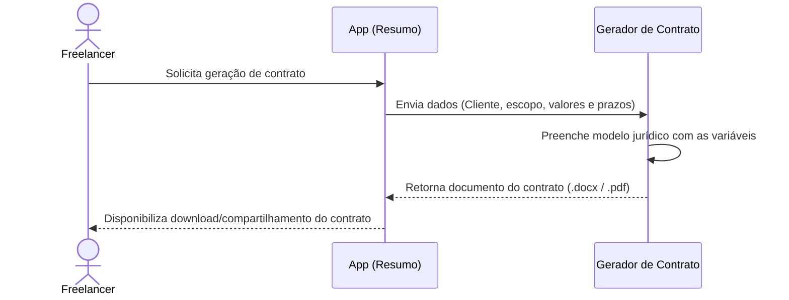

---

### 10. Simulador Financeiro de Cenários ("E se?")
* **Descrição**: Interface interativa que calcula em tempo real o impacto que despesas novas ou alterações nas férias/horas de trabalho exercem sobre o valor/hora mínimo viável.
* **Fluxo de Sistema**:

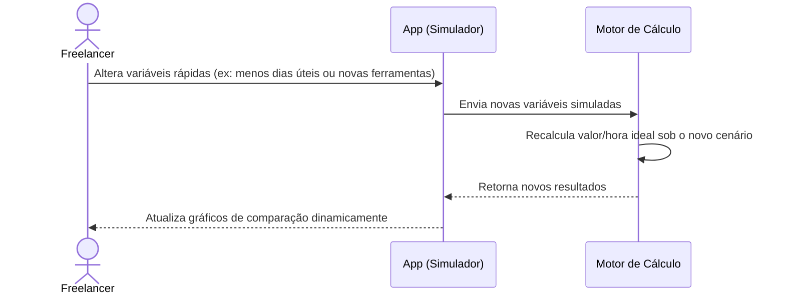
